# Diagram Autentykacji - 10xCards

## Przegląd

Poniższy diagram przedstawia pełny cykl życia procesu autentykacji w aplikacji 10xCards, wykorzystującej React, Astro i Supabase Auth. Diagram obejmuje:

- Rejestrację nowego użytkownika (US-001)
- Logowanie istniejącego użytkownika (US-002)
- Weryfikację sesji przy każdym żądaniu
- Proces odświeżania tokenu
- Wylogowanie użytkownika
- Ochronę tras przed nieautoryzowanym dostępem

## Diagram Sekwencji Autentykacji

```mermaid
sequenceDiagram
    autonumber
    
    participant Browser as Przeglądarka
    participant Middleware as Middleware
    participant API as Astro API
    participant Auth as Supabase Auth

    %% ========================================
    %% REJESTRACJA UŻYTKOWNIKA (US-001)
    %% ========================================
    
    rect rgb(230, 245, 230)
        Note over Browser,Auth: Rejestracja nowego użytkownika (US-001)
        
        Browser->>Browser: Wypełnienie formularza rejestracji
        Browser->>Browser: Walidacja klienta: email, hasło, potwierdzenie
        Browser->>API: POST /api/auth/register
        activate API
        
        API->>API: Walidacja Zod: email, hasło
        API->>Auth: signUp(email, password)
        activate Auth
        
        alt Email już istnieje
            Auth-->>API: Błąd: email zajęty
            API-->>Browser: 409 EMAIL_EXISTS
        else Rejestracja udana
            Auth-->>API: User + Session
            deactivate Auth
            API->>API: Ustawienie ciasteczka sesji
            API-->>Browser: 201 Created + dane użytkownika
            deactivate API
            Browser->>Browser: Przekierowanie do / (widok generowania)
        end
    end

    %% ========================================
    %% LOGOWANIE UŻYTKOWNIKA (US-002)
    %% ========================================
    
    rect rgb(230, 240, 255)
        Note over Browser,Auth: Logowanie użytkownika (US-002)
        
        Browser->>Browser: Wypełnienie formularza logowania
        Browser->>Browser: Walidacja klienta: email, hasło
        Browser->>API: POST /api/auth/login
        activate API
        
        API->>API: Walidacja Zod: email, hasło
        API->>Auth: signInWithPassword(email, password)
        activate Auth
        
        alt Nieprawidłowe dane logowania
            Auth-->>API: Błąd: invalid credentials
            API-->>Browser: 401 INVALID_CREDENTIALS
            Browser->>Browser: Wyświetlenie: Nieprawidłowy login lub hasło
        else Logowanie udane
            Auth-->>API: User + Session + Tokens
            deactivate Auth
            API->>API: Ustawienie ciasteczka HttpOnly z tokenem
            API-->>Browser: 200 OK + dane użytkownika
            deactivate API
            Browser->>Browser: Przekierowanie do / (widok generowania)
        end
    end

    %% ========================================
    %% WERYFIKACJA SESJI PRZY ŻĄDANIU
    %% ========================================
    
    rect rgb(255, 245, 230)
        Note over Browser,Auth: Weryfikacja sesji przy każdym żądaniu
        
        Browser->>Middleware: Żądanie do chronionej trasy
        activate Middleware
        
        Middleware->>Middleware: Odczytanie ciasteczka sesji
        Middleware->>Auth: getUser() - walidacja tokenu
        activate Auth
        Auth-->>Middleware: Odpowiedź walidacji
        deactivate Auth
        
        alt Token ważny
            Middleware->>Middleware: context.locals.user = user
            Middleware->>Middleware: context.locals.session = session
            Middleware->>API: Przekazanie żądania
            activate API
            API-->>Browser: Odpowiedź z danymi
            deactivate API
        else Token wygasł - wymaga odświeżenia
            Middleware->>Auth: Odświeżenie tokenu
            activate Auth
            Auth-->>Middleware: Nowy token
            deactivate Auth
            Middleware->>Middleware: Aktualizacja ciasteczka sesji
            Middleware->>API: Przekazanie żądania
            activate API
            API-->>Browser: Odpowiedź z danymi
            deactivate API
        else Token nieważny lub brak sesji
            Middleware-->>Browser: 302 Redirect do /login
        end
        deactivate Middleware
    end

    %% ========================================
    %% OCHRONA TRAS
    %% ========================================
    
    rect rgb(255, 240, 245)
        Note over Browser,Auth: Ochrona tras przed nieautoryzowanym dostępem
        
        Browser->>Middleware: GET /login (zalogowany użytkownik)
        activate Middleware
        
        Middleware->>Auth: getUser()
        activate Auth
        Auth-->>Middleware: User data (zalogowany)
        deactivate Auth
        
        Middleware-->>Browser: 302 Redirect do /
        deactivate Middleware
        
        Note over Browser: Zalogowany użytkownik nie widzi strony logowania
    end

    %% ========================================
    %% WYLOGOWANIE UŻYTKOWNIKA
    %% ========================================
    
    rect rgb(245, 240, 255)
        Note over Browser,Auth: Wylogowanie użytkownika
        
        Browser->>API: POST /api/auth/logout
        activate API
        
        API->>Auth: signOut()
        activate Auth
        Auth-->>API: Success
        deactivate Auth
        
        API->>API: Usunięcie ciasteczka sesji
        API-->>Browser: 200 OK
        deactivate API
        
        Browser->>Browser: Przekierowanie do /login
    end

    %% ========================================
    %% SESJA WYGASŁA PODCZAS PRACY
    %% ========================================
    
    rect rgb(255, 235, 235)
        Note over Browser,Auth: Reakcja na wygaśnięcie sesji podczas pracy
        
        Browser->>Middleware: POST /api/generations (tworzenie fiszek)
        activate Middleware
        
        Middleware->>Auth: getUser()
        activate Auth
        Auth-->>Middleware: Błąd: sesja wygasła
        deactivate Auth
        
        Middleware-->>Browser: 401 Unauthorized
        deactivate Middleware
        
        Browser->>Browser: Wyświetlenie komunikatu o wygaśnięciu sesji
        Browser->>Browser: Przekierowanie do /login
    end

    %% ========================================
    %% PERSISTENCJA SESJI (US-002 kryterium 4)
    %% ========================================
    
    rect rgb(240, 250, 240)
        Note over Browser,Auth: Persistencja sesji po zamknięciu przeglądarki
        
        Browser->>Browser: Zamknięcie przeglądarki
        Note over Browser: Ciasteczko HttpOnly pozostaje zapisane
        
        Browser->>Browser: Ponowne otwarcie przeglądarki
        Browser->>Middleware: GET / (strona główna)
        activate Middleware
        
        Middleware->>Middleware: Odczytanie ciasteczka sesji
        Middleware->>Auth: getUser() - walidacja tokenu
        activate Auth
        Auth-->>Middleware: Odpowiedź walidacji
        deactivate Auth
        
        alt Sesja nadal ważna
            Middleware->>API: Przekazanie żądania
            activate API
            API-->>Browser: Widok generowania (zalogowany)
            deactivate API
        else Sesja wygasła
            Middleware-->>Browser: 302 Redirect do /login
        end
        deactivate Middleware
    end
```

## Legenda

| Kolor sekcji | Opis przepływu |
|--------------|----------------|
| 🟢 Zielony | Rejestracja użytkownika |
| 🔵 Niebieski | Logowanie użytkownika |
| 🟠 Pomarańczowy | Weryfikacja sesji |
| 🟣 Fioletowy | Wylogowanie |
| 🔴 Czerwony | Obsługa wygasłej sesji |
| 🟢 Jasnozielony | Persistencja sesji |

## Kluczowe elementy architektury

### Aktorzy

1. **Przeglądarka** - interfejs użytkownika (React + Astro)
2. **Middleware** - warstwa pośrednia Astro do walidacji sesji i ochrony tras
3. **Astro API** - endpointy API (`/api/auth/*`)
4. **Supabase Auth** - zewnętrzna usługa autentykacji

### Mechanizmy bezpieczeństwa

- **Ciasteczka HttpOnly** - ochrona przed atakami XSS
- **SameSite: Lax** - ochrona przed CSRF
- **Walidacja Zod** - walidacja danych wejściowych na serwerze
- **Rate Limiting** - ograniczenie liczby żądań (5/min dla generowania)

### Endpointy API

| Endpoint | Metoda | Opis |
|----------|--------|------|
| `/api/auth/register` | POST | Rejestracja nowego użytkownika |
| `/api/auth/login` | POST | Logowanie użytkownika |
| `/api/auth/logout` | POST | Wylogowanie użytkownika |
| `/api/auth/session` | GET | Sprawdzenie statusu sesji |

### Trasy publiczne

- `/login` - strona logowania
- `/register` - strona rejestracji
- `/api/auth/login` - endpoint logowania
- `/api/auth/register` - endpoint rejestracji

### Trasy chronione

Wszystkie pozostałe trasy wymagają aktywnej sesji użytkownika.
