# Diagram Podróży Użytkownika - 10xCards

## Opis
Diagram przedstawia kompleksową podróż użytkownika w aplikacji 10xCards, obejmującą procesy autentykacji (rejestracja, logowanie) oraz główne funkcjonalności aplikacji (generowanie fiszek, zarządzanie kolekcją, system powtórek). Diagram został utworzony zgodnie z wymaganiami z PRD oraz specyfikacją autentykacji.

## Diagram

```mermaid
stateDiagram-v2
    [*] --> Start
    Start: Uruchomienie Aplikacji
    
    state "Sprawdzanie Sesji" as CheckSession
    Start --> CheckSession
    
    state if_session <<choice>>
    CheckSession --> if_session
    if_session --> WidokGenerowania: Sesja ważna
    if_session --> StronaLogowania: Brak sesji
    
    state "Autentykacja" as Auth {
        [*] --> StronaLogowania
        
        state "Strona Logowania" as StronaLogowania {
            [*] --> FormularzLogowania
            FormularzLogowania: Pola email i hasło
            note right of FormularzLogowania
                Walidacja kliencka:
                - Email wymagany i poprawny format
                - Hasło wymagane
            end note
            
            FormularzLogowania --> WalidacjaLogowania
            
            state if_login <<choice>>
            WalidacjaLogowania --> if_login
            if_login --> LogowanieSerwer: Dane poprawne
            if_login --> FormularzLogowania: Błąd walidacji
            
            LogowanieSerwer --> if_auth <<choice>>
            if_auth --> SesjaUtworzona: Dane prawidłowe
            if_auth --> BladLogowania: Nieprawidłowe dane
            
            BladLogowania: Komunikat o błędzie
            note right of BladLogowania
                "Nieprawidłowy login lub hasło"
            end note
            BladLogowania --> FormularzLogowania
            
            FormularzLogowania --> LinkRejestracji
            LinkRejestracji --> [*]
        }
        
        state "Strona Rejestracji" as StronaRejestracji {
            [*] --> FormularzRejestracji
            FormularzRejestracji: Pola email, hasło, powtórz hasło
            note right of FormularzRejestracji
                Walidacja kliencka:
                - Email wymagany i poprawny format
                - Hasło min. 8 znaków
                - Hasła muszą się zgadzać
            end note
            
            FormularzRejestracji --> WalidacjaRejestracji
            
            state if_register <<choice>>
            WalidacjaRejestracji --> if_register
            if_register --> RejestracjaSerwer: Dane poprawne
            if_register --> FormularzRejestracji: Błąd walidacji
            
            RejestracjaSerwer --> if_email <<choice>>
            if_email --> TworzenieKonta: Email dostępny
            if_email --> BladEmailZajety: Email zajęty
            
            BladEmailZajety: Komunikat o błędzie
            note right of BladEmailZajety
                "Ten adres email jest już zajęty"
            end note
            BladEmailZajety --> FormularzRejestracji
            
            TworzenieKonta --> AutoLogowanie
            AutoLogowanie --> SesjaUtworzona
            
            FormularzRejestracji --> LinkLogowania
            LinkLogowania --> [*]
        }
        
        SesjaUtworzona --> [*]
        StronaLogowania --> StronaRejestracji: Link do rejestracji
        StronaRejestracji --> StronaLogowania: Link do logowania
    }
    
    Auth --> WidokGenerowania: Przekierowanie do głównego panelu
    
    state "Główna Aplikacja" as MainApp {
        [*] --> WidokGenerowania
        
        state "Widok Generowania Fiszek" as WidokGenerowania {
            [*] --> PoleWpisywaniaTekstu
            PoleWpisywaniaTekstu: Textarea i przycisk Generuj
            note right of PoleWpisywaniaTekstu
                Limity: 1000-10000 znaków
                Walidacja przed wysłaniem
            end note
            
            PoleWpisywaniaTekstu --> WalidacjaTekstu
            
            state if_text_valid <<choice>>
            WalidacjaTekstu --> if_text_valid
            if_text_valid --> ProcesGenerowania: Tekst poprawny
            if_text_valid --> KomunikatBleduTekstu: Błąd walidacji
            
            KomunikatBleduTekstu: Komunikat o błędzie
            KomunikatBleduTekstu --> PoleWpisywaniaTekstu
            
            ProcesGenerowania: Wskaźnik ładowania
            note right of ProcesGenerowania
                Interfejs zablokowany
                Wywołanie API generacji AI
            end note
            
            ProcesGenerowania --> if_generation <<choice>>
            if_generation --> RecenzjaFiszek: Sukces
            if_generation --> BladGenerowania: Błąd
            
            BladGenerowania: Komunikat o błędzie
            BladGenerowania --> PoleWpisywaniaTekstu
            
            state "Recenzja Wygenerowanych Fiszek" as RecenzjaFiszek {
                [*] --> ListaFiszek
                note right of ListaFiszek
                    Każda fiszka ma przyciski:
                    - Akceptuj
                    - Edytuj
                    - Odrzuć
                end note
                
                ListaFiszek --> AkcjaFiszki
                
                state if_action <<choice>>
                AkcjaFiszki --> if_action
                if_action --> FiszkaZaakceptowana: Akceptuj
                if_action --> EdycjaFiszki: Edytuj
                if_action --> FiszkaOdrzucona: Odrzuć
                
                FiszkaOdrzucona: Usunięcie z listy
                FiszkaOdrzucona --> ListaFiszek
                
                state "Edycja Fiszki" as EdycjaFiszki {
                    [*] --> ModalEdycji
                    ModalEdycji: Formularz z polami przód/tył
                    ModalEdycji --> ZapisZmian
                    ZapisZmian --> [*]
                }
                
                EdycjaFiszki --> FiszkaZaakceptowana: Po zapisie
                FiszkaZaakceptowana --> ListaFiszek
                
                ListaFiszek --> ZapisDoKolekcji: Przycisk Zapisz w kolekcji
                ZapisDoKolekcji --> [*]
            }
            
            RecenzjaFiszek --> [*]
        }
        
        state "Lista Moich Fiszek" as ListaFiszek {
            [*] --> if_empty <<choice>>
            if_empty --> WidokPusty: Brak fiszek
            if_empty --> ListaFiszekPelna: Fiszki istnieją
            
            WidokPusty: Przycisk niedostępny
            note right of WidokPusty
                Użytkownik pozostaje w widoku generowania
            end note
            WidokPusty --> [*]
            
            state "Pełna Lista Fiszek" as ListaFiszekPelna {
                [*] --> PrzegladanieListy
                PrzegladanieListy: Lista wszystkich fiszek użytkownika
                
                PrzegladanieListy --> WyszukiwanieFiszek
                WyszukiwanieFiszek: Pole wyszukiwania pełnotekstowego
                WyszukiwanieFiszek --> WynikiWyszukiwania
                WynikiWyszukiwania --> PrzegladanieListy
                
                PrzegladanieListy --> DodawanieFiszki: Przycisk Dodaj fiszkę
                PrzegladanieListy --> EdycjaIstniejacejFiszki: Przycisk Edytuj
                PrzegladanieListy --> UsuwanieFiszki: Przycisk Usuń
                
                state "Dodawanie Ręcznej Fiszki" as DodawanieFiszki {
                    [*] --> ModalDodawania
                    ModalDodawania: Formularz przód/tył
                    note right of ModalDodawania
                        Oba pola wymagane
                    end note
                    ModalDodawania --> WalidacjaFiszki
                    
                    state if_valid_card <<choice>>
                    WalidacjaFiszki --> if_valid_card
                    if_valid_card --> ZapisFiszki: Dane poprawne
                    if_valid_card --> ModalDodawania: Błąd walidacji
                    
                    ZapisFiszki --> [*]
                }
                
                state "Edycja Istniejącej Fiszki" as EdycjaIstniejacejFiszki {
                    [*] --> ModalEdycjiIstniejacejFiszki
                    ModalEdycjiIstniejacejFiszki: Formularz z aktualnymi danymi
                    ModalEdycjiIstniejacejFiszki --> AktualizacjaFiszki
                    AktualizacjaFiszki --> [*]
                }
                
                state "Usuwanie Fiszki" as UsuwanieFiszki {
                    [*] --> DialogPotwierdzenia
                    DialogPotwierdzenia: Modal z pytaniem
                    DialogPotwierdzenia --> if_confirm <<choice>>
                    if_confirm --> TrwaleUsuniecie: Potwierdzenie
                    if_confirm --> [*]: Anulowanie
                    TrwaleUsuniecie --> [*]
                }
                
                DodawanieFiszki --> PrzegladanieListy
                EdycjaIstniejacejFiszki --> PrzegladanieListy
                UsuwanieFiszki --> PrzegladanieListy
            }
        }
        
        state "Sesja Powtórkowa" as SesjaPowtorkowa {
            [*] --> RozpoczecieNauki
            RozpoczecieNauki: Przycisk Rozpocznij naukę
            
            RozpoczecieNauki --> if_cards_available <<choice>>
            if_cards_available --> PokazywanieFiszki: Fiszki do powtórki
            if_cards_available --> BrakFiszek: Brak fiszek
            
            BrakFiszek: Komunikat o braku fiszek
            BrakFiszek --> [*]
            
            state "Pokazywanie Fiszki" as PokazywanieFiszki {
                [*] --> PrzodFiszki
                PrzodFiszki: Wyświetlenie przodu fiszki
                PrzodFiszki --> OdkrycieTypu: Kliknięcie odkryj
                OdkrycieTypu: Wyświetlenie tyłu fiszki
                
                OdkrycieTypu --> OcenaOdpowiedzi
                OcenaOdpowiedzi: Przyciski oceny
                note right of OcenaOdpowiedzi
                    Opcje: Wiedziałem / Nie wiedziałem
                    Przekazane do algorytmu powtórek
                end note
                
                OcenaOdpowiedzi --> [*]
            }
            
            PokazywanieFiszki --> if_more_cards <<choice>>
            if_more_cards --> PokazywanieFiszki: Kolejna fiszka
            if_more_cards --> ZakonczenieSesji: Koniec sesji
            
            ZakonczenieSesji: Podsumowanie sesji
            ZakonczenieSesji --> [*]
        }
        
        state "Zarządzanie Kontem" as ZarzadzanieKontem {
            [*] --> Ustawienia
            Ustawienia: Panel ustawień konta
            
            Ustawienia --> ZmianaHasla
            
            state "Zmiana Hasła" as ZmianaHasla {
                [*] --> FormularzZmianyHasla
                FormularzZmianyHasla: Stare hasło, nowe hasło, powtórz
                
                FormularzZmianyHasla --> WalidacjaStaregoHasla
                
                state if_old_password <<choice>>
                WalidacjaStaregoHasla --> if_old_password
                if_old_password --> AktualizacjaHasla: Stare hasło poprawne
                if_old_password --> BladStaregoHasla: Błąd weryfikacji
                
                BladStaregoHasla --> FormularzZmianyHasla
                
                AktualizacjaHasla --> PotwierdzenieMianyHasla
                PotwierdzenieMianyHasla: Komunikat sukcesu
                PotwierdzenieMianyHasla --> [*]
            }
            
            Ustawienia --> Wylogowanie: Przycisk wyloguj
            Wylogowanie --> [*]
        }
        
        WidokGenerowania --> ListaFiszek: Link Moje fiszki
        ListaFiszek --> WidokGenerowania: Link Generuj
        WidokGenerowania --> SesjaPowtorkowa: Link Rozpocznij naukę
        SesjaPowtorkowa --> WidokGenerowania: Powrót
        ListaFiszek --> SesjaPowtorkowa: Link Rozpocznij naukę
        SesjaPowtorkowa --> ListaFiszek: Powrót
        
        WidokGenerowania --> ZarzadzanieKontem: Menu użytkownika
        ListaFiszek --> ZarzadzanieKontem: Menu użytkownika
        SesjaPowtorkowa --> ZarzadzanieKontem: Menu użytkownika
    }
    
    ZarzadzanieKontem --> Wylogowanie
    Wylogowanie --> StronaLogowania: Usunięcie sesji
    
    MainApp --> [*]: Zakończenie
    
    note right of WidokGenerowania
        Domyślny widok po zalogowaniu
        zgodnie z US-007
    end note
    
    note right of ListaFiszek
        Dostępny tylko gdy użytkownik
        ma zapisane fiszki
    end note
    
    note right of Auth
        System sesji oparty na cookies Supabase
        Sesja persystuje po zamknięciu przeglądarki
    end note
```

## Kluczowe Elementy Podróży

### 1. Autentykacja
- **Rejestracja (US-001)**: Nowy użytkownik tworzy konto z walidacją email i hasła
- **Logowanie (US-002)**: Istniejący użytkownik loguje się z persystencją sesji
- **Sesja**: Automatyczne utrzymywanie sesji przez Supabase cookies

### 2. Generowanie Fiszek
- **Wpisywanie tekstu (US-004)**: Walidacja 1000-10000 znaków
- **Proces AI**: Automatyczne generowanie przez model AI
- **Recenzja (US-005)**: Akceptacja, edycja lub odrzucenie każdej fiszki
- **Zapis**: Przeniesienie zaakceptowanych fiszek do kolekcji

### 3. Zarządzanie Kolekcją
- **Lista fiszek (US-007)**: Przeglądanie wszystkich zapisanych fiszek
- **Wyszukiwanie (US-009)**: Pełnotekstowe wyszukiwanie po zawartości
- **Dodawanie ręczne (US-006)**: Tworzenie pojedynczych fiszek
- **Edycja (US-010)**: Modyfikacja istniejących fiszek
- **Usuwanie (US-011)**: Trwałe usunięcie z potwierdzeniem

### 4. System Powtórek
- **Sesja nauki (US-012)**: Algorytm spaced repetition
- **Ocena odpowiedzi**: Informacja zwrotna dla algorytmu
- **Harmonogram**: Automatyczne planowanie kolejnych powtórek

### 5. Zarządzanie Kontem
- **Zmiana hasła (US-003)**: Aktualizacja hasła z walidacją
- **Wylogowanie**: Zakończenie sesji i przekierowanie

## Punkty Decyzyjne

1. **Sesja ważna?** → Dostęp do aplikacji lub przekierowanie do logowania
2. **Email zajęty?** → Komunikat błędu przy rejestracji
3. **Dane logowania poprawne?** → Dostęp lub komunikat błędu
4. **Tekst w zakresie?** → Rozpoczęcie generowania lub komunikat błędu
5. **Generowanie sukces?** → Recenzja fiszek lub komunikat błędu
6. **Akcja z fiszką?** → Akceptacja, edycja lub odrzucenie
7. **Lista pusta?** → Stan pusty lub pełna lista
8. **Potwierdzenie usunięcia?** → Usunięcie lub anulowanie
9. **Fiszki do powtórki?** → Sesja nauki lub komunikat o braku

## Zgodność z PRD

Diagram uwzględnia wszystkie user stories z sekcji 5 PRD:
- US-001 do US-003: Zarządzanie kontem
- US-004 do US-011: Generowanie i zarządzanie fiszkami
- US-012 do US-013: System powtórek i logowanie

Diagram odzwierciedla granice MVP (sekcja 4.2):
- ✅ Aplikacja webowa
- ✅ Fiszki tekstowe przód-tył
- ✅ System login/hasło
- ✅ Zewnętrzny algorytm powtórek
- ❌ Brak odzyskiwania hasła (poza MVP)
- ❌ Brak OAuth (poza MVP)
