# Diagram Architektury UI - 10xCards

## Diagram komponentów UI z modułem autentykacji

```mermaid
flowchart TD
    %% ===================================================================
    %% WARSTWA LAYOUTÓW
    %% ===================================================================
    subgraph LAYOUTS["📐 Warstwa Layoutów"]
        direction TB
        AuthLayout["AuthLayout.astro<br/>Layout dla stron autentykacji"]
        MainLayout["Layout.astro<br/>Główny layout aplikacji<br/>(ZAKTUALIZOWANY)"]
        
        subgraph MainLayoutElements["Elementy Layout.astro"]
            NavHeader["Nagłówek nawigacyjny"]
            UserMenuComp["UserMenu (React)"]
            LogoutBtn["LogoutButton (React)"]
        end
        
        MainLayout --> NavHeader
        NavHeader --> UserMenuComp
        UserMenuComp --> LogoutBtn
    end
    
    %% ===================================================================
    %% STRONY ASTRO - AUTENTYKACJA
    %% ===================================================================
    subgraph AUTH_PAGES["🔐 Strony Autentykacji (Astro SSR)"]
        direction TB
        LoginPage["/login.astro<br/>Strona logowania<br/>(NOWA)"]
        RegisterPage["/register.astro<br/>Strona rejestracji<br/>(NOWA)"]
        RecoverPage["/recover-password.astro<br/>Odzyskiwanie hasła<br/>(POZA MVP)"]
        
        LoginPage --> AuthLayout
        RegisterPage --> AuthLayout
        RecoverPage --> AuthLayout
    end
    
    %% ===================================================================
    %% STRONY ASTRO - GŁÓWNA APLIKACJA
    %% ===================================================================
    subgraph APP_PAGES["📄 Strony Aplikacji (Astro SSR)"]
        direction TB
        IndexPage["/index.astro<br/>Główny panel - generowanie fiszek<br/>(ZAKTUALIZOWANY: sprawdzanie auth)"]
        
        IndexPage --> MainLayout
    end
    
    %% ===================================================================
    %% KOMPONENTY REACT - AUTENTYKACJA
    %% ===================================================================
    subgraph AUTH_COMPONENTS["🔑 Komponenty Autentykacji (React)"]
        direction TB
        
        subgraph AuthForms["Formularze"]
            LoginForm["LoginForm.tsx<br/>- Email + hasło<br/>- Walidacja kliencka<br/>- POST /api/auth/login"]
            RegisterForm["RegisterForm.tsx<br/>- Email + hasło + potwierdzenie<br/>- Walidacja zgodności haseł<br/>- POST /api/auth/register"]
        end
        
        subgraph AuthHelpers["Komponenty pomocnicze"]
            PasswordInput["PasswordInput.tsx<br/>Pole hasła z przełącznikiem widoczności"]
            AuthFormWrapper["AuthFormWrapper.tsx<br/>Wspólny kontener dla formularzy<br/>+ obsługa błędów"]
        end
        
        LoginForm --> PasswordInput
        LoginForm --> AuthFormWrapper
        RegisterForm --> PasswordInput
        RegisterForm --> AuthFormWrapper
    end
    
    LoginPage -.->|renderuje| LoginForm
    RegisterPage -.->|renderuje| RegisterForm
    
    %% ===================================================================
    %% KOMPONENTY REACT - GENEROWANIE FISZEK (ISTNIEJĄCE)
    %% ===================================================================
    subgraph GEN_COMPONENTS["⚡ Moduł Generowania Fiszek (React - istniejący)"]
        direction TB
        
        GenerationView["GenerationView.tsx<br/>(ZAKTUALIZOWANY: obsługa 401 errors)"]
        
        subgraph GenSubComponents["Podkomponenty generowania"]
            TextInputSection["TextInputSection.tsx"]
            CharCounter["CharacterCounter.tsx"]
            GenerateBtn["GenerateButton.tsx"]
            ProgressBar["ProgressBar.tsx"]
            InfoBox["InfoBox.tsx"]
            FlashcardReview["SuggestedFlashcardsReview.tsx"]
            FlashcardCard["FlashcardPreviewCard.tsx"]
            FlashcardModal["FlashcardModal.tsx"]
            ConfirmDialog["ConfirmDialog.tsx"]
            ToastContainer["ToastContainer.tsx"]
        end
        
        GenerationView --> TextInputSection
        GenerationView --> GenerateBtn
        GenerationView --> FlashcardReview
        GenerationView --> ToastContainer
        
        TextInputSection --> CharCounter
        FlashcardReview --> FlashcardCard
        FlashcardReview --> FlashcardModal
        FlashcardReview --> ConfirmDialog
        GenerationView --> ProgressBar
        GenerationView --> InfoBox
    end
    
    IndexPage -.->|renderuje client:only| GenerationView
    
    %% ===================================================================
    %% HOOKI REACT
    %% ===================================================================
    subgraph HOOKS["🪝 Custom Hooks (React)"]
        direction TB
        
        subgraph AuthHooks["Hooki autentykacji (NOWE)"]
            useLoginForm["useLoginForm.ts<br/>Stan i logika logowania"]
            useRegisterForm["useRegisterForm.ts<br/>Stan i logika rejestracji"]
            useAuth["useAuth.ts<br/>Globalny stan auth i akcje"]
        end
        
        subgraph GenHooks["Hooki generowania (istniejące)"]
            useGenState["useGenerationViewState.ts"]
            useCharCounter["useCharacterCounter.ts"]
            useFlashcardModal["useFlashcardModal.ts"]
            useToast["useToastNotifications.ts"]
            useConfirm["useConfirmDialog.ts"]
        end
        
        LoginForm --> useLoginForm
        RegisterForm --> useRegisterForm
        UserMenuComp --> useAuth
        LogoutBtn --> useAuth
        
        GenerationView --> useGenState
        TextInputSection --> useCharCounter
        FlashcardModal --> useFlashcardModal
        ToastContainer --> useToast
        ConfirmDialog --> useConfirm
    end
    
    %% ===================================================================
    %% KOMPONENTY UI SHADCN (WSPÓŁDZIELONE)
    %% ===================================================================
    subgraph UI_COMPONENTS["🎨 Komponenty UI Shadcn (współdzielone)"]
        direction LR
        Button["button.tsx"]
        Dialog["dialog.tsx"]
        Label["label.tsx"]
        Textarea["textarea.tsx"]
        AlertDialog["alert-dialog.tsx"]
        Sonner["sonner.tsx<br/>(toasty)"]
        Collapsible["collapsible.tsx"]
    end
    
    LoginForm --> Button
    LoginForm --> Label
    RegisterForm --> Button
    RegisterForm --> Label
    PasswordInput --> Button
    UserMenuComp --> Dialog
    LogoutBtn --> Button
    GenerateBtn --> Button
    TextInputSection --> Textarea
    TextInputSection --> Label
    FlashcardModal --> Dialog
    ConfirmDialog --> AlertDialog
    ToastContainer --> Sonner
    InfoBox --> Collapsible
    
    %% ===================================================================
    %% WARSTWA API
    %% ===================================================================
    subgraph API_LAYER["🔌 Warstwa API (Astro Endpoints)"]
        direction TB
        
        subgraph AuthAPI["API Autentykacji (NOWE)"]
            LoginAPI["POST /api/auth/login<br/>Logowanie użytkownika"]
            RegisterAPI["POST /api/auth/register<br/>Rejestracja nowego użytkownika"]
            LogoutAPI["POST /api/auth/logout<br/>Wylogowanie"]
            SessionAPI["GET /api/auth/session<br/>Sprawdzenie statusu sesji"]
        end
        
        subgraph AppAPI["API Aplikacji (istniejące)"]
            GenerationsAPI["POST /api/generations<br/>Generowanie fiszek AI<br/>(wymaga auth)"]
            FlashcardsAPI["GET/POST/PUT/DELETE /api/flashcards<br/>CRUD fiszek<br/>(wymaga auth)"]
            ReviewsAPI["GET /api/reviews<br/>Fiszki do powtórki<br/>(wymaga auth)"]
        end
    end
    
    LoginForm -.->|HTTP POST| LoginAPI
    RegisterForm -.->|HTTP POST| RegisterAPI
    LogoutBtn -.->|HTTP POST| LogoutAPI
    useAuth -.->|HTTP GET| SessionAPI
    
    GenerationView -.->|HTTP POST| GenerationsAPI
    
    %% ===================================================================
    %% WARSTWA SERWISÓW
    %% ===================================================================
    subgraph SERVICES["⚙️ Warstwa Serwisów"]
        direction TB
        
        subgraph AuthServices["Serwisy autentykacji (NOWE)"]
            AuthService["auth.service.ts<br/>register(), login(), logout()"]
            AuthErrors["auth.error.ts<br/>InvalidCredentialsError<br/>EmailExistsError, etc."]
            AuthValidators["auth.validators.ts (Zod)<br/>emailSchema, passwordSchema<br/>registerSchema, loginSchema"]
        end
        
        subgraph AppServices["Serwisy aplikacji (istniejące)"]
            GenerationService["generation.service.ts"]
            FlashcardService["flashcard.service.ts"]
            ReviewService["review.service.ts"]
            OpenRouterService["openrouter.service.ts"]
        end
    end
    
    LoginAPI --> AuthService
    RegisterAPI --> AuthService
    LogoutAPI --> AuthService
    
    LoginAPI --> AuthValidators
    RegisterAPI --> AuthValidators
    
    AuthService --> AuthErrors
    
    GenerationsAPI --> GenerationService
    FlashcardsAPI --> FlashcardService
    ReviewsAPI --> ReviewService
    GenerationService --> OpenRouterService
    
    %% ===================================================================
    %% MIDDLEWARE
    %% ===================================================================
    subgraph MIDDLEWARE["🛡️ Middleware Astro (ZAKTUALIZOWANY)"]
        direction TB
        MiddlewareLogic["middleware/index.ts<br/>- Weryfikacja sesji Supabase<br/>- Ochrona chronionych tras<br/>- Redirect do /login jeśli brak auth<br/>- Redirect do / jeśli auth na /login<br/>- Rate limiting (5 req/min)"]
    end
    
    AUTH_PAGES -.->|przed renderowaniem| MIDDLEWARE
    APP_PAGES -.->|przed renderowaniem| MIDDLEWARE
    API_LAYER -.->|przed wykonaniem| MIDDLEWARE
    
    %% ===================================================================
    %% SUPABASE
    %% ===================================================================
    subgraph SUPABASE["☁️ Supabase Backend"]
        direction TB
        
        subgraph SupabaseClients["Klienty Supabase"]
            SupabaseClient["supabase.client.ts<br/>Klient dla operacji klienckich"]
            SupabaseServer["supabase.server.ts<br/>Klient SSR z obsługą cookies<br/>(NOWY - @supabase/ssr)"]
        end
        
        subgraph SupabaseServices["Usługi Supabase"]
            SupabaseAuth["Supabase Auth<br/>Zarządzanie użytkownikami i sesjami"]
            SupabaseDB["Supabase Database<br/>Tabele: flashcards, generations,<br/>spaced_repetition_state"]
        end
        
        SupabaseTypes["database.types.ts<br/>Typy TypeScript z bazy"]
    end
    
    AuthService --> SupabaseServer
    MiddlewareLogic --> SupabaseClient
    GenerationService --> SupabaseClient
    FlashcardService --> SupabaseClient
    ReviewService --> SupabaseClient
    
    SupabaseServer --> SupabaseAuth
    SupabaseClient --> SupabaseDB
    SupabaseClient --> SupabaseAuth
    
    SupabaseClient -.->|używa typów| SupabaseTypes
    SupabaseServer -.->|używa typów| SupabaseTypes
    
    %% ===================================================================
    %% TYPY I WALIDACJA
    %% ===================================================================
    subgraph TYPES["📋 Typy i Schematy"]
        direction TB
        AppTypes["types.ts<br/>DTOs dla całej aplikacji<br/>(ZAKTUALIZOWANY: auth DTOs)"]
        EnvTypes["env.d.ts<br/>Typy dla Astro.locals<br/>(ZAKTUALIZOWANY: session, user)"]
    end
    
    AuthValidators -.->|definiuje| AppTypes
    MIDDLEWARE -.->|używa| EnvTypes
    
    %% ===================================================================
    %% STYLE
    %% ===================================================================
    classDef newComponent fill:#a8e6cf,stroke:#4caf50,stroke-width:3px,color:#000
    classDef updatedComponent fill:#ffd3b6,stroke:#ff9800,stroke-width:3px,color:#000
    classDef existingComponent fill:#d4e4f7,stroke:#2196f3,stroke-width:2px,color:#000
    classDef apiComponent fill:#ffccf9,stroke:#9c27b0,stroke-width:2px,color:#000
    classDef serviceComponent fill:#fff9c4,stroke:#fbc02d,stroke-width:2px,color:#000
    classDef infrastructureComponent fill:#e0e0e0,stroke:#616161,stroke-width:2px,color:#000
    
    %% Nowe komponenty
    class LoginPage,RegisterPage,RecoverPage,AuthLayout newComponent
    class LoginForm,RegisterForm,PasswordInput,AuthFormWrapper,UserMenuComp,LogoutBtn newComponent
    class useLoginForm,useRegisterForm,useAuth newComponent
    class LoginAPI,RegisterAPI,LogoutAPI,SessionAPI newComponent
    class AuthService,AuthErrors,AuthValidators newComponent
    class SupabaseServer newComponent
    
    %% Zaktualizowane komponenty
    class MainLayout,IndexPage,GenerationView,MiddlewareLogic updatedComponent
    class AppTypes,EnvTypes updatedComponent
    
    %% Istniejące komponenty
    class TextInputSection,CharCounter,GenerateBtn,ProgressBar existingComponent
    class InfoBox,FlashcardReview,FlashcardCard,FlashcardModal existingComponent
    class ConfirmDialog,ToastContainer existingComponent
    class useGenState,useCharCounter,useFlashcardModal,useToast,useConfirm existingComponent
    class Button,Dialog,Label,Textarea,AlertDialog,Sonner,Collapsible existingComponent
    class GenerationsAPI,FlashcardsAPI,ReviewsAPI existingComponent
    class GenerationService,FlashcardService,ReviewService,OpenRouterService existingComponent
    
    %% API i infrastruktura
    class SupabaseClient,SupabaseAuth,SupabaseDB,SupabaseTypes infrastructureComponent
```



## Legenda

- **🟢 Zielone (nowe komponenty)**: Elementy dodane w ramach implementacji modułu autentykacji
- **🟠 Pomarańczowe (zaktualizowane)**: Istniejące elementy wymagające modyfikacji
- **🔵 Niebieskie (istniejące)**: Komponenty bez zmian, już zaimplementowane
- **⚪ Szare (infrastruktura)**: Warstwa Supabase i konfiguracja

## Kluczowe przepływy

### 1. Przepływ rejestracji (US-001)
```
Użytkownik → /register → RegisterForm → POST /api/auth/register 
→ auth.service.ts → Supabase Auth → auto-login → redirect do /
```

### 2. Przepływ logowania (US-002)
```
Użytkownik → /login → LoginForm → POST /api/auth/login 
→ auth.service.ts → Supabase Auth → sesja w cookies → redirect do /
```

### 3. Middleware - ochrona tras
```
Każde żądanie → middleware sprawdza sesję Supabase
- Brak sesji + chroniona trasa → redirect do /login
- Aktywna sesja + /login lub /register → redirect do /
- Rate limiting dla /api/generations (5 req/min)
```

### 4. Przepływ generowania fiszek (z auth)
```
Użytkownik (zalogowany) → GenerationView → POST /api/generations
→ middleware weryfikuje sesję → generation.service.ts → OpenRouter API
→ zwrot fiszek → SuggestedFlashcardsReview → akceptacja → zapis w DB
```

### 5. Wylogowanie
```
UserMenu/LogoutButton → POST /api/auth/logout 
→ Supabase signOut() → czyszczenie cookies → redirect do /login
```

## Uwagi implementacyjne

### Priorytety wdrożenia (auth-spec.md, sekcja 5):

**Faza 1: Infrastruktura podstawowa**
1. Instalacja `@supabase/ssr`
2. Utworzenie `supabase.server.ts`
3. Aktualizacja middleware dla obsługi sesji
4. Aktualizacja `env.d.ts` z typami session/user

**Faza 2: API Endpoints**
1. Walidatory auth (Zod schemas)
2. Auth service i typy błędów
3. Endpointy: /api/auth/{register, login, logout, session}

**Faza 3: Komponenty UI**
1. AuthLayout
2. Formularze: LoginForm, RegisterForm
3. Komponenty pomocnicze: PasswordInput, UserMenu, LogoutButton
4. Custom hooks: useLoginForm, useRegisterForm, useAuth

**Faza 4: Integracja**
1. Strony: /login, /register
2. Aktualizacja Layout.astro (nawigacja + UserMenu)
3. Aktualizacja index.astro (sprawdzanie auth)
4. Aktualizacja GenerationView (obsługa 401)

### Bezpieczeństwo:
- **HttpOnly cookies** - ochrona przed XSS
- **SameSite: Lax** - ochrona przed CSRF
- **Walidacja Zod** - walidacja danych wejściowych
- **Rate limiting** - 5 żądań/min dla generowania fiszek
- **RLS w Supabase** - izolacja danych użytkowników na poziomie bazy

### Zgodność z PRD:
- US-001: Rejestracja email/hasło ✅
- US-002: Logowanie z persystencją sesji ✅
- US-003: Zmiana hasła (future - nie w MVP)
- US-007: Domyślny widok po loginie to `/` (generowanie) ✅
- US-008: Brak fiszek → tylko widok generowania ✅

### Poza zakresem MVP:
- Odzyskiwanie hasła dla zapomnianych haseł (infrastruktura przygotowana)
- OAuth/social login
- Checkbox "Zapamiętaj mnie" (Supabase domyślnie persystuje sesję)
